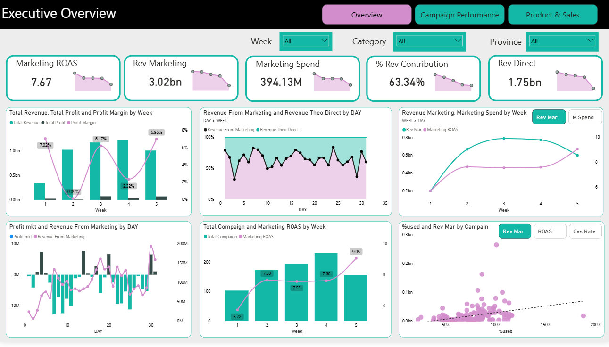
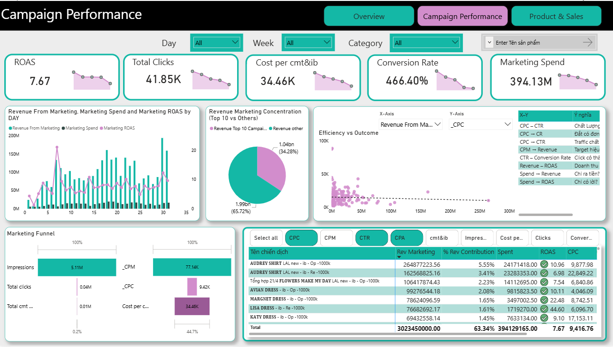
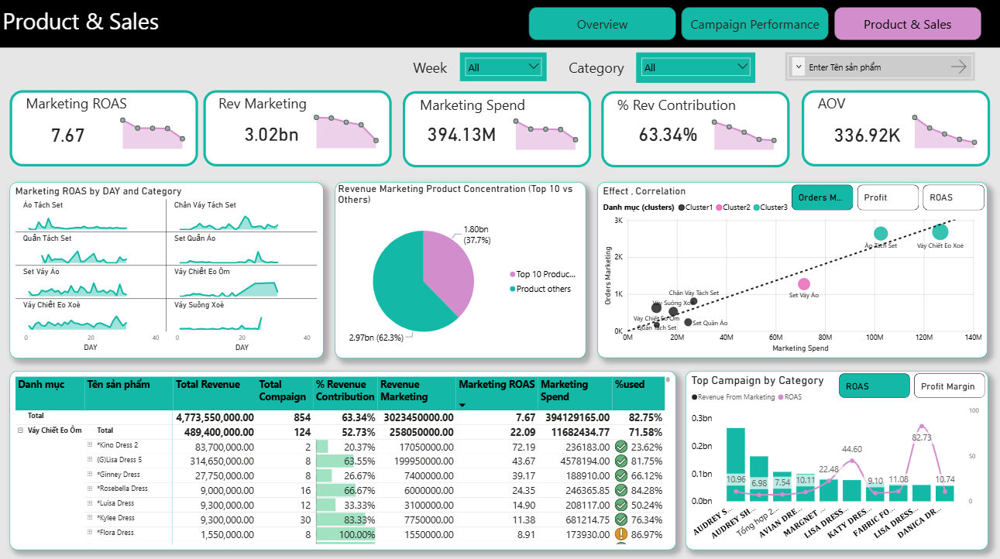

# Fashion Marketing & Sales Analysis | Power-BI

Author: Lê Anh Tuấn  

Tool Used: Power BI  

***

## 📑**Table of Contents**
1. [📌 Background & Overview](#background--overview)
2. [📂 Dataset Description & Data Structure](#dataset-description--data-structure)
3. [🧠 Design Thinking Process](#design-thinking-process)
4. [📊 Key Insights & Visualizations](#key-insights--visualizations)

## 📌 Overview

### 🎯 Project Objectives

This project aims to help senior managers monitor marketing budget allocation, evaluate campaign effectiveness, and identify which campaigns, product categories, and SKUs generate the strongest revenue and profitability impact.

The dashboard supports data-driven decisions on where to scale, optimize, reduce, or reallocate marketing budget to improve overall marketing efficiency.

### ❓ Business Questions

1. How is the marketing budget allocated and utilized across time, campaigns, product categories, and SKUs?

2. How effectively are marketing campaigns performing in terms of spend efficiency, revenue contribution, ROAS, CPC, and conversion performance?

3. Which campaigns, product categories, and SKUs are driving profitable growth, and where should the company scale, optimize, or reduce marketing investment?

👤**Target Audience**
- Marketing Team: to track marketing performance and decide which campaigns to scale, pause, or optimize.
- Head of Sales & Marketing: to view revenue, profit, and efficiency of marketing investment at a high level, compare channels (ads vs direct sales) and guide budget allocation

## 🎯 Project Outcome

- Developed a Power BI decision-support dashboard for senior managers to track marketing budget allocation, evaluate campaign efficiency, and connect marketing spend with sales and product performance.

- The analysis revealed that marketing-driven sales contributed **63.34% of total revenue**, with an overall **Marketing ROAS of 7.67**, highlighting marketing as a key revenue driver. The dashboard also helped identify high-performing campaigns and SKUs, as well as underperforming areas that require budget optimization.

- By combining KPIs such as revenue contribution, ROAS, CPC, conversion performance, marketing spend, and profit margin, the dashboard supports more confident decisions on where to scale, optimize, reduce, or reallocate marketing budget.

## 📂 Dataset Description & Data Structure
### 📌 Data Source

- Context: This dataset comes from a fashion company in Vietnam that operates mainly in retail and e-commerce. The company runs many multi-channel marketing campaigns (online and offline) to drive sales and build its brand.

1️⃣ **Tables**
- **Note: Dataset and column names are in Vietnamese, so this project focuses on documenting the table role and key fields instead of translating every column one by one.**
- Dataset includes 4 tables:
  - fact-order (3451 records): sale transations\
    Contains one row per order line, including:
    - Order info: ID, date, order status
    - Sales metrics: unit price, units sold, unit cost
    - Customer info: customer name, tier, birthday, city/province
    - Product info: product name, parent product code / barcode, product category
      
  - fact-mkt_camp_by_sku_cost (3844 records): Campaign × SKU performance\
    One row per campaign–product–day, including:
    - Date, product code / name
    - Campaign spend and allocated budget at SKU level
    - Media metrics: impressions, clicks, CPC, CPM, CTR
    - Engagement: inbox + comments (by ad manager/AM)
    - Performance: units sold via campaign, remaining inventory, etc.

  - dim-mkt_camp_cost (854 records): Campaign-level performance (one campaign can last many days and spend budget differently) \
    One row per campaign–day, including:
    - Campaign name, date, status
    - Daily budget and actual spend
    - Media KPIs: impressions, clicks, CPC, CPM, CTR
  - dim-danh sach san pham (dim-product_list) (2250 records): Product catalog\
    One row per product, including:
    - Product ID and barcodes
    - Product category and type
    - Product name
    - Cost fields: original cost, selling price, selling price with VAT
    - Attributes: status, colour, material, pattern, etc.
- Format: xlsx

2️⃣**Data Wrangling & Data Model Preparation**

**- Basic cleaning:**
  - Checked and corrected data types for all columns.
  - Removed duplicate rows and blank rows in all tables.
  - Dropped columns that were not needed for analysis.

**- Date dimension:**
  - Built a _dim_date_ table from _fact-order_:
    - Generated a continuous date range based on the min/ max order dates.
    - Added calendar attributes: Date, Year, Quarter, Month, Month Name, Week, Week number, Weekday, Day, Day Name, etc.
    - Linked dim_date to both fact-order and fact-mkt_camp_by_sku_cost tables so time-based analysis (by day, week, month) is consistent across the model.
      
**- Campaign keys (Primary & Foreign Key):**
  - In _dim-mkt_camp_cost_:
    - Created a custom column by combining **Campaign Name + Date + Budget Spent**.
    - Added an index on this column and used it as a unique **Campaign Id** (primary key).
  - In _fact-mkt_camp_by_sku_cost_:
    - Merged _fact-mkt_camp_by_sku_cost_ with _dim-mkt_camp_cost_ on **Campaign Name + Date + Budget Spent**.
    - Expanded the merge to bring **Campaign Id** into _fact-mkt_camp_by_sku_cost_.
    - **Campaign Id** now acts as a foreign key linking campaign costs and SKU-level performance.
   
 **- Tagging orders as Ads Sales vs Direct Sales:**
  - Table: fact-order
      - This table contains all orders (both store / organic sales and campaign-driven sales).
      - Goal: identify which orders came from campaigns to separate Ads Revenue from Direct Revenue.\
  - Steps:
     - Create a helper table
        - Duplicated_ fact-mkt_camp_by_sku_cost_ → _fact-mkt_camp_by_sku_cost (2)_.
        - Kept only **Date** and **Product Code**, then removed duplicates.
        - Result: a list of **Product Code + Date** combinations that were sold via campaigns.
     - Merge with orders
        - Merged_ fact-order_ with _fact-mkt_camp_by_sku_cost (2_) on **Date + Product Code**.
        - Expanded the merge to bring back **Product Code** from the campaign table.
      - Classify channel
        - Added a conditional column **Ads/Direct** in _fact-order_:
          - If the merged **Product Code** is not null → "Ads Sales".
          - If it is null → "Direct Sales".

3️⃣**Data Relationship**

From the data tables above, I created Star Schema Model as below

**Relationships between tables**

| From Table | To Table | Join Key | Relationship Type |
|----------|----------|----------|----------|
|dim_date| fact-order| dim_date[Date] → fact-order[Thời gian]| One to many (1:*)|
|dim_date| fact-mkt_camp_by_sku_cost| dim_date[Date] → fact-mkt_camp_by_sku_cost[Ngày]| One to many (1:*)|
|dim-product_list| fact-order| dim-product_list[Mã sản phẩm] → fact-order[Mã sản phẩm cha]| One to many (1:*)|
|dim-product_list| fact-mkt_camp_by_sku_cost| dim-product_list[Mã sản phẩm] → fact-mkt_camp_by_sku_cost[Mã Sản phẩm]| One to many (1:*)|
|dim-mkt_camp_cost| fact-mkt_camp_by_sku_cost|dim-mkt_camp_cost[Campaign Id] → fact-mkt_camp_by_sku_cost[Campaign Id]| One to many (1:*)|

## 🧠 Design Thinking Process

### 1️⃣ Empathize

### 2️⃣ Define point of view 

## 📊 Key Insights & Visualizations

### 🔍 Dashboard Preview

## 1️⃣ Executive Overview

### Business Questions Answered

- How is the marketing budget allocated and utilized over time?
- Is marketing spend translating into revenue and business impact?
- How much does marketing contribute to total revenue compared with direct sales?
- Which time periods show stronger or weaker marketing efficiency?

### Key Insights

#### 1. Marketing is the main revenue driver

Marketing generated **3.02bn revenue**, contributing **63.34% of total revenue**, while direct revenue reached **1.75bn**. This shows that marketing campaigns play a major role in driving sales and are currently a key growth engine for the business.

**Business meaning:**  
Marketing is not only a support function; it directly drives the majority of revenue. However, this also means the business is highly exposed to changes in campaign performance and advertising cost.

---

#### 2. Overall ROAS is strong, but efficiency varies across weeks

Overall Marketing ROAS reached **7.67**, meaning every 1 VND spent on marketing generated around 7.67 VND in marketing-attributed revenue. However, weekly ROAS fluctuates, with the strongest week reaching around **9.05**, while other weeks stay around **5.72–7.63**.

**Business meaning:**  
The company is generating positive return from marketing overall, but efficiency is not consistent. Some weeks use budget more effectively than others, suggesting that campaign mix, product mix, and timing strongly affect performance.

---

#### 3. Higher budget usage does not always lead to proportional revenue growth

The scatter plot between budget usage and marketing revenue shows that some campaigns use a high share of budget but do not always generate proportional revenue. This indicates that simply increasing budget does not guarantee better performance.

**Business meaning:**  
Budget decisions should not be based only on how much a campaign spends. Senior managers need to compare spend with ROAS, revenue contribution, and product-level performance before scaling.

---

### Recommendations

#### 1. Reduce overdependence on paid campaign-driven revenue

- **Where to act:** Revenue mix between marketing-driven revenue and direct revenue.
- **What to do:** Maintain high-performing campaigns while strengthening retention-based and direct revenue channels such as email marketing, loyalty programs, remarketing, customer reactivation, and organic content.
- **Why it matters:** More than 60% of revenue comes from marketing-driven sales, so the business becomes vulnerable if ad costs increase or campaign performance declines.
- **Goal:** Keep marketing as a growth driver while building more sustainable revenue sources beyond paid campaigns.

---

#### 2. Manage weekly budget using efficiency KPIs, not spend volume alone

- **Where to act:** Weekly budget allocation and campaign performance review.
- **What to do:** Compare each week by Marketing ROAS, revenue contribution, campaign mix, product mix, and profit margin before deciding whether to increase budget.
- **Why it matters:** The dashboard shows that higher spend does not always create better efficiency. Some weeks perform better because the right campaigns and products are promoted.
- **Goal:** Improve average ROAS by reallocating budget toward weeks, campaigns, and SKUs with stronger efficiency patterns.

---

#### 3. Use the highest-ROAS week as a benchmark for future planning

- **Where to act:** Campaign and SKU mix from the highest-performing week.
- **What to do:** Identify which campaigns, SKUs, and categories contributed most to the strongest ROAS week, then reuse those patterns in future campaign planning.
- **Why it matters:** The best-performing week provides a practical benchmark for what an efficient campaign/product mix looks like.
- **Goal:** Replicate high-efficiency patterns to improve future marketing budget allocation.

---

## 2️⃣ Campaign Performance

### Business Questions Answered

- Which campaigns generate the highest marketing revenue?
- Which campaigns perform best or worst based on ROAS, CPC, conversion-related performance, and revenue contribution?
- Where are the main bottlenecks in the marketing funnel?
- Is marketing revenue concentrated in only a few top campaigns or spread across many campaigns?

### Key Insights

#### 1. Marketing revenue is distributed across many campaigns, not only the Top 10

The Top 10 campaigns generated **1.04bn**, accounting for **34.28%** of marketing revenue. The remaining campaigns contributed **1.99bn**, or **65.72%**.

**Business meaning:**  
Long-tail campaigns play a major role in total revenue. Focusing only on the largest campaigns may miss many smaller campaigns that either contribute meaningful revenue or contain hidden efficiency opportunities.

---

#### 2. The biggest funnel bottleneck is from impressions to clicks

The campaign funnel shows around **5.11M impressions** but only **41.85K clicks**, meaning many users see the ads but only a small share decide to click or interact.

**Business meaning:**  
The main issue is likely at the top of the funnel: creative quality, targeting, product message, offer, or CTA may not be strong enough to convert ad exposure into traffic and customer intent.

---

#### 3. High-revenue campaigns are not always the most efficient campaigns

Some campaigns such as **AUDREY SHIRT** generate high marketing revenue, while campaigns such as **LISA DRESS** and **MARGNET DRESS** show stronger ROAS efficiency.

**Business meaning:**  
Campaigns should not be evaluated by revenue alone. High-revenue campaigns help scale sales, but high-ROAS campaigns are important for improving budget efficiency.

---

#### 4. The conversion-related metric needs clearer definition

The dashboard currently shows **Conversion Rate = 466.40%**. If this metric is not a standard click-to-order or visit-to-order conversion rate, it may confuse business users because standard conversion rates normally should not exceed 100%.

**Business meaning:**  
KPI clarity is critical for decision-making. A metric that is unclear or poorly named can reduce trust in the dashboard, even if the calculation itself is useful.

---

### Recommendations

#### 1. Optimize the full campaign portfolio, not only the Top 10 campaigns

- **Where to act:** Full campaign portfolio, especially campaigns outside the Top 10.
- **What to do:** Classify campaigns into **Scale**, **Test More**, **Optimize**, and **Reduce/Pause** groups based on ROAS, spend, revenue contribution, CPC, and conversion-related performance.
- **Why it matters:** Campaigns outside the Top 10 contribute more than 60% of marketing revenue, so there may be many opportunities beyond the largest campaigns.
- **Goal:** Improve overall campaign portfolio efficiency instead of optimizing only the most visible campaigns.

---

#### 2. Improve the Impression → Click stage

- **Where to act:** Top-of-funnel campaign performance.
- **What to do:** A/B test ad creatives, product visuals, headlines, offers, CTAs, and audience targeting. Prioritize campaigns with high impressions but low click performance.
- **Why it matters:** Low click-through performance means the company is paying for reach but not generating enough qualified traffic or customer intent.
- **Goal:** Increase CTR, reduce CPC, and bring more qualified users into the sales funnel.

---

#### 3. Balance revenue drivers and efficiency drivers

- **Where to act:** Campaign budget allocation.
- **What to do:** Maintain high-revenue campaigns that drive scale, but run controlled budget tests for high-ROAS campaigns that are currently underfunded.
- **Why it matters:** Revenue drivers help increase sales volume, while efficiency drivers improve return per VND spent. The business needs both scale and efficiency.
- **Goal:** Grow revenue while improving average campaign ROAS.

---

#### 4. Rename or clarify the conversion-related KPI

- **Where to act:** KPI naming and dashboard documentation.
- **What to do:** Review the current conversion formula. If the metric can exceed 100%, rename it to a clearer term such as **Sales per Interaction**, **Order-to-Interaction Ratio**, or **Interaction-to-Sales Efficiency**.
- **Why it matters:** Senior managers need simple, trustworthy KPIs. A conversion rate above 100% may create confusion if the definition is not clearly explained.
- **Goal:** Improve dashboard credibility and make KPI interpretation easier for business users.

---

## 3️⃣ Product & Sales

### Business Questions Answered

- Which product categories and SKUs generate the strongest sales impact from marketing?
- Is marketing budget being allocated to the right product categories?
- Which products should be scaled, optimized, or reduced based on ROAS, spend, revenue, and orders?
- Is product revenue concentrated in only a few top SKUs or spread across many products?

### Key Insights

#### 1. Product revenue is not concentrated only in the Top 10 products

The Top 10 products contributed around **37.7%** of revenue, while other products contributed **62.3%**.

**Business meaning:**  
The company should not focus only on best-selling SKUs. Many non-top products still contribute significant revenue and may contain hidden opportunities for budget optimization.

---

#### 2. “Váy Chiết Eo Ôm” is a high-efficiency category with strong ROAS

The category **Váy Chiết Eo Ôm** generated around **258.05M marketing revenue** with only **11.68M marketing spend**, achieving a strong **Marketing ROAS of 22.09**, much higher than the overall ROAS of **7.67**.

**Business meaning:**  
This category appears underutilized relative to its efficiency. It generates strong revenue return with relatively low marketing spend, making it a strong candidate for controlled scaling.

---

#### 3. Several SKUs inside “Váy Chiết Eo Ôm” show strong scaling potential

SKUs such as **Kino Dress**, **Lisa Dress**, and **Ginney Dress** show much higher ROAS than the overall average.

**Business meaning:**  
The category’s strong performance is not driven by one product only. Multiple SKUs show high efficiency, which reduces dependency on a single SKU and increases confidence for controlled budget testing.

---

#### 4. Core revenue categories should be protected but monitored carefully

Categories such as **Váy Chiết Eo Xòe** and **Áo Tách Set** appear to be important revenue and order drivers. However, high revenue categories should still be evaluated by ROAS, spend efficiency, inventory, and product-level margin before receiving more budget.

**Business meaning:**  
Core categories are important for sales volume, but scaling them without efficiency control may reduce overall marketing performance.

---

### Recommendations

#### 1. Gradually scale high-ROAS product categories

- **Where to act:** High-efficiency categories, especially **Váy Chiết Eo Ôm** and its best-performing SKUs.
- **What to do:** Increase budget gradually by 15–25% for strong SKUs such as Lisa Dress, Kino Dress, and Ginney Dress, while monitoring ROAS, orders, inventory, and profit margin.
- **Why it matters:** These SKUs generate strong revenue return with relatively low marketing spend, indicating underutilized potential.
- **Goal:** Capture additional revenue from high-efficiency products without reducing ROAS through uncontrolled scaling.

---

#### 2. Protect core revenue categories but avoid blind scaling

- **Where to act:** High-revenue and high-order categories such as **Váy Chiết Eo Xòe** and **Áo Tách Set**.
- **What to do:** Maintain their role as core revenue drivers, but evaluate them by ROAS, profit margin, discount level, inventory, and product-level contribution before increasing budget.
- **Why it matters:** These categories are important for sales volume, but high revenue does not always mean high efficiency.
- **Goal:** Keep stable sales volume while preventing inefficient budget expansion.

---

#### 3. Build SKU-level decision groups

- **Where to act:** Product and SKU portfolio.
- **What to do:** Classify SKUs into four decision groups:
  - **Hero Products:** high revenue and stable efficiency
  - **High-ROAS Products:** strong efficiency and room to scale
  - **Optimization Products:** decent sales but weak efficiency
  - **Low-Priority Products:** low revenue and low ROAS
- **Why it matters:** Product performance is spread across many SKUs, so SKU-level grouping helps identify both major revenue drivers and hidden high-efficiency products.
- **Goal:** Make product-level budget decisions more structured and data-driven.

---

#### 4. Reallocate budget from low-efficiency products to high-efficiency SKUs

- **Where to act:** Product categories or SKUs with high spend but lower ROAS.
- **What to do:** Review pricing, discount strategy, creative messaging, product page quality, inventory, and audience targeting. If performance does not improve, shift part of the budget to high-ROAS categories and SKUs.
- **Why it matters:** Continuing to spend on low-efficiency products can reduce overall marketing ROAS and limit efficient revenue growth.
- **Goal:** Improve marketing budget efficiency by funding products that generate stronger return per VND spent.

---

## 🎯 Budget Optimization Framework

| Segment | Condition | Business Meaning | Recommended Action |
|---|---|---|---|
| **Scale** | High ROAS + High Revenue Contribution | Strong business impact and efficient spend | Increase budget gradually |
| **Test More** | High ROAS + Low Spend | Efficient but currently underfunded | Run controlled budget tests |
| **Optimize** | High Spend + Low ROAS | Budget is not converting efficiently | Improve creative, targeting, offer, or product page |
| **Reduce / Pause** | Low ROAS + Low Revenue Contribution | Weak impact and inefficient spend | Reduce or pause investment |

---

## ✅ Final Executive Summary

Marketing is a major revenue driver, contributing **63.34% of total revenue** with an overall **Marketing ROAS of 7.67**. However, performance varies across weeks, campaigns, and SKUs, meaning that higher spending does not always lead to better efficiency.

Campaign revenue is distributed across a wide portfolio, with campaigns outside the Top 10 contributing **65.72%** of marketing revenue. This shows that budget optimization should cover the full campaign portfolio, not only the biggest campaigns.

At the product level, **Váy Chiết Eo Ôm** stands out as a high-efficiency category with **22.09 ROAS**, much higher than the overall average. This category and its strong SKUs should receive controlled budget scaling, while low-efficiency campaigns and products should be optimized or reduced.

The company should make budget decisions based on a combination of **Marketing ROAS, revenue contribution, CPC, conversion-related performance, product category performance, SKU-level efficiency, and profit margin**, instead of relying only on revenue volume.
